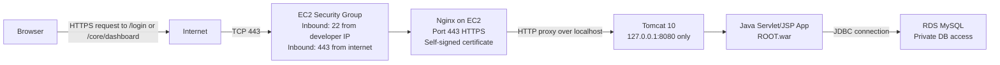
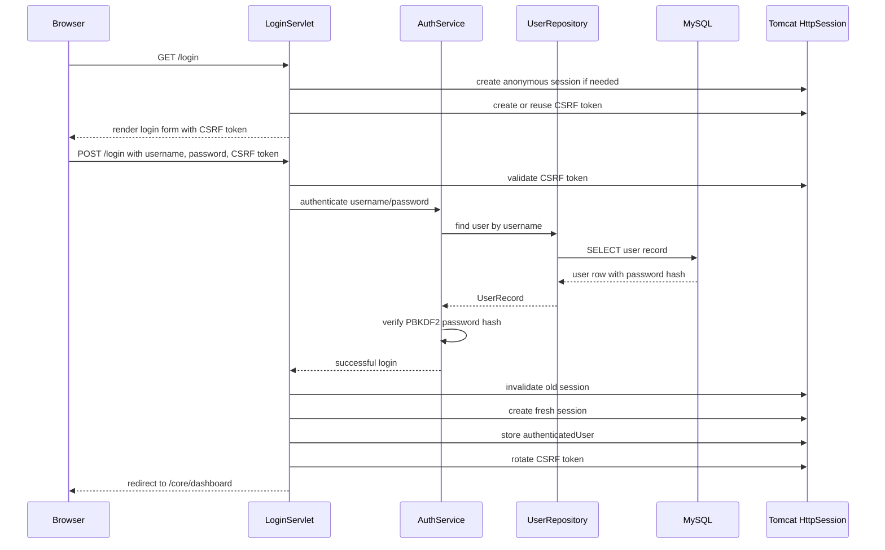
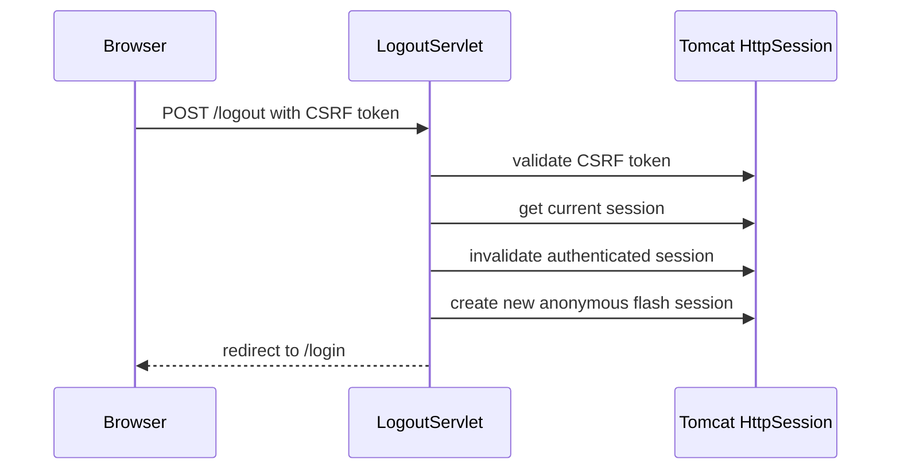

# Authorization and TLS Flow

This document describes the current deployment and authorization model for the
Gig Assessment Java web application.

## Current Deployment

The application is deployed on an Amazon Linux EC2 instance. Nginx is the public
web server and TLS termination point. Tomcat runs behind Nginx and only listens
on localhost.



Important deployment properties:

- Public users reach the app through `https://ec2-3-142-68-78.us-east-2.compute.amazonaws.com`.
- Nginx listens on port `443` with a self-signed certificate.
- Nginx does not listen on port `80`, so plain HTTP is not served.
- Tomcat listens only on `127.0.0.1:8080`, so it is not directly exposed to the internet.
- The EC2 security group should allow public inbound `443`, but not `80`, `8080`, or `3306`.
- RDS MySQL should only allow database traffic from the EC2 security group.

Because the certificate is self-signed, browsers will warn that the certificate
is not trusted. The traffic is still encrypted. In a production deployment, the
self-signed certificate should be replaced with a certificate from a trusted
certificate authority such as Let's Encrypt or AWS ACM.

## Why Nginx Handles TLS

Nginx is responsible for receiving HTTPS traffic from browsers. It then forwards
requests to Tomcat over localhost.

```text
Browser --HTTPS--> Nginx --HTTP over 127.0.0.1--> Tomcat
```

This is a common deployment pattern. The unencrypted hop is not crossing the
network because Nginx and Tomcat run on the same EC2 instance.

Nginx forwards these headers to Tomcat:

```nginx
proxy_set_header X-Real-IP $remote_addr;
proxy_set_header X-Forwarded-For $proxy_add_x_forwarded_for;
proxy_set_header X-Forwarded-Proto https;
proxy_set_header X-Forwarded-Host $host;
proxy_set_header X-Forwarded-Port 443;
```

Tomcat is configured with `RemoteIpValve` so the application can understand that
the original browser request used HTTPS. This matters because servlet code such
as `request.isSecure()` depends on Tomcat understanding the original request
scheme.

## Session-Based Authentication

This project uses server-side sessions, not JWTs.

The browser stores only a random session ID cookie:

```text
id=<random-session-id>
```

The actual login state is stored on the server inside Tomcat's `HttpSession`:

```text
session id -> {
  authenticatedUser: user,
  csrfToken: token
}
```

The session cookie is an opaque identifier. That means the browser cannot decode
it and it does not contain the username or password. Tomcat uses the cookie value
to look up the server-side session.

## Login Flow



The important security step is session rotation after login:

```java
HttpSession oldSession = request.getSession(false);
if (oldSession != null) {
    oldSession.invalidate();
}

HttpSession session = request.getSession(true);
session.setAttribute(AuthConstants.AUTHENTICATED_USER, user);
```

This protects against session fixation. Session fixation is when an attacker
tries to make a victim log in using a session ID that the attacker already
knows. Invalidating the old session and creating a fresh authenticated session
prevents that old ID from becoming the logged-in session.

## Authorization Flow

Protected routes are under:

```text
/core/*
```

`AuthFilter` enforces authorization:

```text
Request to /core/dashboard
  -> check if session exists
  -> check if session contains authenticatedUser
  -> if yes, allow request
  -> if no, redirect to /login
```

This means the server does not trust the cookie by itself. The cookie must map
to a valid server-side session that contains `authenticatedUser`.

## Logout Flow

Logout uses a POST request and requires a valid CSRF token.



`session.invalidate()` destroys the server-side session. If someone saved the
old session cookie and tries to reuse it after logout, Tomcat should no longer
have a valid authenticated session for that ID.

The new session created after logout only stores a flash message such as:

```text
You have been logged out.
```

It does not contain `authenticatedUser`, so it is not an authenticated session.

## CSRF Protection

The application stores a CSRF token in the server-side session and includes it
as a hidden form value.

On form submission, the server compares:

```text
CSRF token from session
CSRF token from submitted form
```

This protects state-changing form submissions such as login, logout, signup, and
password reset from cross-site request forgery.

## Password Security

User passwords are not stored in plain text. They are hashed with:

```text
PBKDF2WithHmacSHA256
600,000 iterations
per-user random salt
constant-time comparison
```

The stored password credential has this shape:

```text
pbkdf2_sha256$600000$salt$hash
```

The application also tracks failed login attempts. After too many failures, the
account is temporarily locked to slow brute-force guessing.

## Cookie Security

The session cookie is configured with:

```text
HttpOnly
Secure
SameSite=Strict
```

What these mean:

- `HttpOnly` prevents browser JavaScript from reading the session cookie.
- `Secure` tells the browser to send the session cookie only over HTTPS.
- `SameSite=Strict` reduces cross-site request risk by limiting when the browser sends the cookie.

In production-like HTTPS mode, `AUTH_SECURE_COOKIES=true` is set for Tomcat so
the application marks session cookies as `Secure`.

## Security Headers

The application sends security headers such as:

```text
X-Content-Type-Options: nosniff
X-Frame-Options: DENY
Referrer-Policy: no-referrer
Content-Security-Policy: default-src 'self'; ...
Strict-Transport-Security: max-age=31536000; includeSubDomains
```

`Strict-Transport-Security` is sent when Tomcat recognizes the request as secure.
The `RemoteIpValve` and Nginx forwarded headers make this work behind the reverse
proxy.

## Current Security Summary

The current setup protects the application in these ways:

- HTTPS is required at the public entry point.
- Plain HTTP is not served.
- Tomcat is not exposed publicly.
- RDS is not exposed publicly.
- Server-side sessions keep login state on the server.
- Sessions are rotated on login.
- Sessions are invalidated on logout.
- CSRF tokens protect form submissions.
- Passwords are salted and hashed with PBKDF2.
- Session cookies are `Secure`, `HttpOnly`, and `SameSite=Strict`.

The main limitation is the self-signed certificate. It encrypts traffic, but
browsers do not trust it automatically. For a real production deployment, use a
trusted certificate from Let's Encrypt or AWS ACM with a domain name that you
control.
